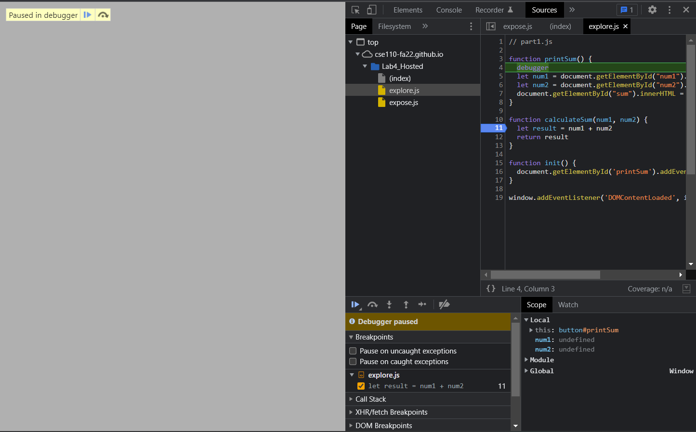
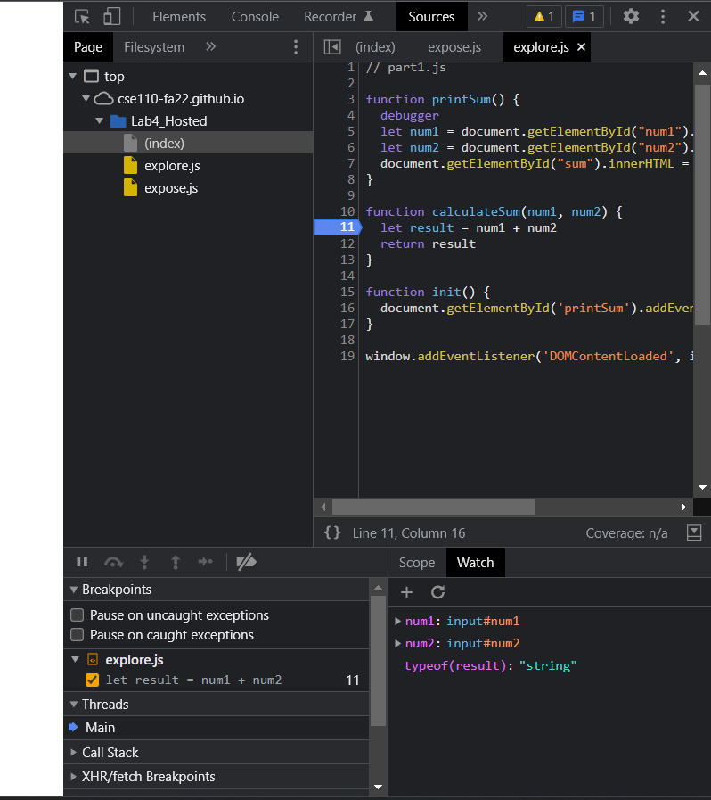
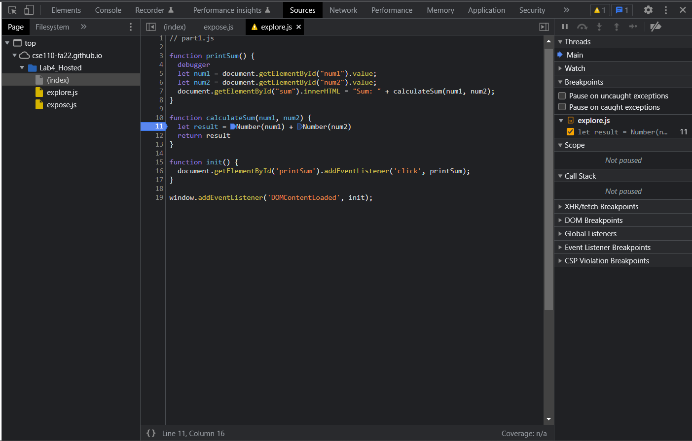

1. The issue is that `num1` and `num2` are left as strings. Unfortunately, this means when we add them together and return result, we're getting a concatenated string of `num1` and `num2`.

2. We can fix this issue by converting the variables to intergers before adding them together in `result`.

